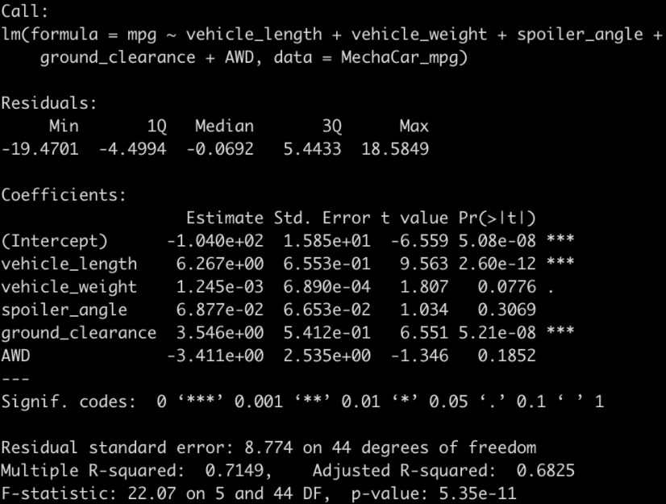
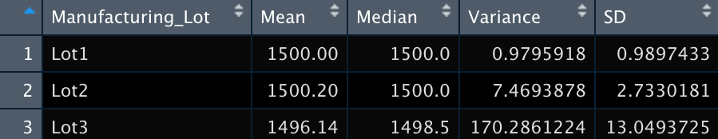
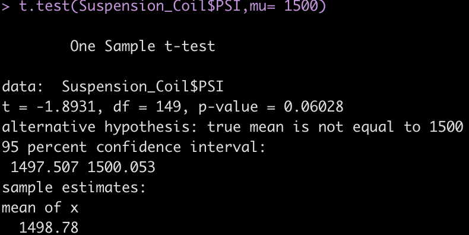
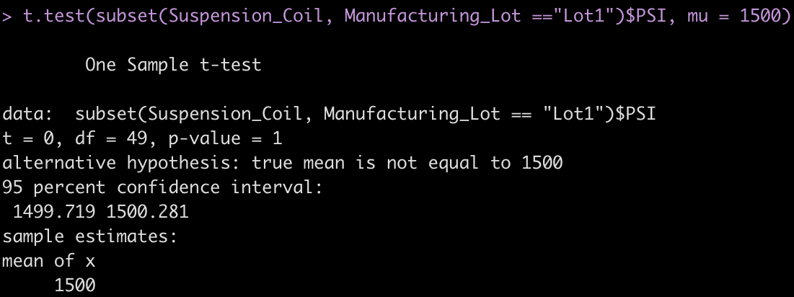
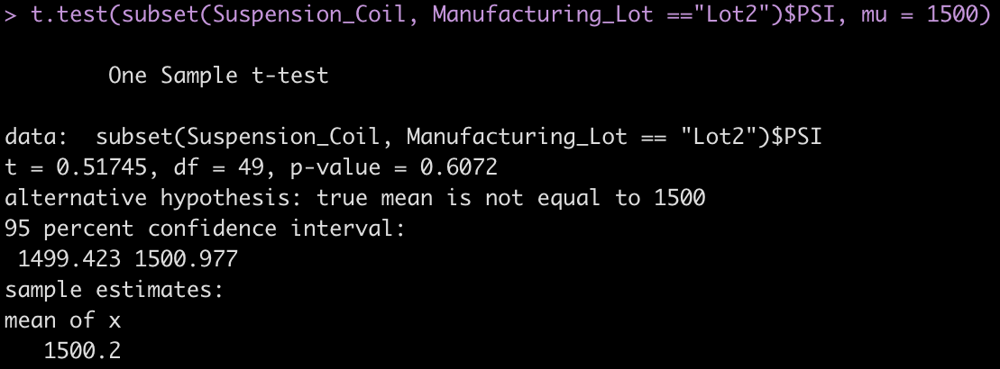
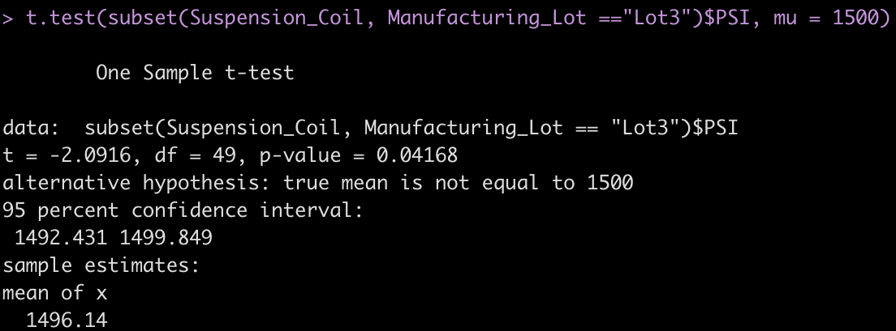

# MechaCar_Statistical_Analysis

In this repository, I will be exploring MechaCar data vs Competitors to see who has the edge in certain aspects. During this project, I worked with excel files (csv) and loaded them into R and Rstudio to run analysis. The results of my project will be explained below.

## Linear Regression to Predict MPG

Question 1: Which variables/coefficients provided a non-random amount of variance to the mpg values in the dataset?
- The variables/coefficients that provided the most non-random amount of variance to the mpg values were the Spoiler Angle, AWD, and Vehicle Weight all provided non-random variance to the mpg value. They are directly tied to the impact on the mpg value.

Question 2: Is the slope of the linear model considered to be zero? Why or why not?
- The slope of the linear model is not considered 0. The p-value for this data set was 5.35x10^-11 which is much lower than the alpha value of .05. This means changes in the predictor variable are tied with changes in the response variable.

Question 3: Does this linear model predict mpg of MechaCar prototypes effectively? Why or why not?
- My R-squared value predicted the mpg of MechaCar prototypes correctly 71.49% of the time. This mean nearly 28.5% if failed. Although it is almost 3/4 of the way effective, I would not feel comfortable setting this model forward. There are other factors/variable that could greatly increase the effectiveness of our R-sqaured value. There are probably many variables we do not have access to which would increase our model effectiveness. A figure showing my R-squared value is shown below.

## Summary Statistics on Suspension Coils

Do the design specifications for the MechaCar suspension coils dictate that the variance of the suspension coils must not exceed 100 pounds per square inch. Does the current manufacturing data meet this design specification for all manufacturing lots in total and each lot individually? Why or why not?

- Lot 1 will work. It meets the specification requirements listed above.
- Lot 2 will work. It meets the specification requirements listed above.
- Lot 3 will not work. It has a variance of 170.3 which exceeds the 100 psi set forth in the design specifications.

## T-Tests on Suspension Coils

## Study Design: MechaCar vs Competition

